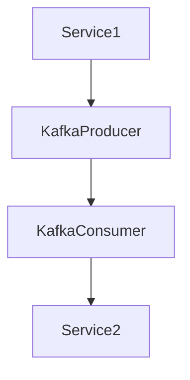

# GymApp Backend

A Spring Boot-based backend application for managing gym workouts, exercises, and routines. This application provides a comprehensive API for tracking fitness progress and managing workout plans.
## Table of Contents
1. [GymApp Backend](#gymapp-backend)
2. [Technology Stack](#technology-stack)
   - [Core](#core)
   - [Testing](#testing)
   - [Documentation & Development](#documentation--development)
3. [Project Structure](#project-structure)
4. [Communication between Modules](#communication-between-modules)
5. [Getting Started](#getting-started)
   - [Prerequisites](#prerequisites)
   - [Running with Docker for Development](#running-with-docker-for-development)
   - [Running with Docker for Deployment](#running-with-docker-for-deployment)
6. [API Documentation](#api-documentation)
7. [Testing](#testing)
8. [Database Schema](#database-schema)
9. [Contributing](#contributing)
   - [Branch Naming Convention](#branch-naming-convention)
   - [Development Workflow](#development-workflow)
   - [Pull Request Requirements](#pull-request-requirements)
10. [License](#license)

## Technology Stack

### Core
- Java 21
- Spring Boot 3.3.4
- Spring Modulith
- Spring Security with JWT
- Spring Data JPA
- PostgreSQL
- Liquibase for database migrations
- Apache Kafka for event based communication between modules

### Testing
- JUnit 5
- Testcontainers
- Spring Boot Test

### Documentation & Development
- OpenAPI (Swagger)
- Spring Actuator
- Docker & Docker Compose

## Project Structure

The application follows a modular architecture with the following main components:
```
src/
├── main/
│ ├── java/
│ │ └── com/sourcery/gymapp/backend/
│ │ ├── workout/ # Workout management module
│ │ ├── userauth/ # Authentication module
│ │ ├── userprofile/ # User profiles module
│ │ └── sharedlinks/ # Sharing functionality
│ └── resources/
│ ├── db/changelog/ # Database migrations
│ └── application.yaml # Application configuration
```

## Communication between modules
Since modules don't have common database schema and are separated in codebase, 
the communication between them follows asynchronous event-driven design, utilizing Apache Kafka.

How does it work? General event passing flow looks like this:


For every type of communication/event/functionality there should be a dedicated Kafka Topic. They are specified in `configuration.yaml` by `spring.kafka.topics` field (which is a key-value map) and auto-created using Spring configuration file.
There are also 2 special Topics:
- DeadLetter (if Service2 cannot process something many times, its put into a deadzone/archive)
- Retry (Service2 may put something here if it could process it 1st time and retry it in an hour)

## Getting Started

### Prerequisites
- JDK 21
- Docker and Docker Compose

### Running with Docker for development

1. Clone the repository:
```bash
git clone https://github.com/Sourcery-Graduates/GymAppBE.git
cd GymAppBE
```

2. Start the application infrastructure using Docker Compose:
```bash
docker-compose up -d
```

3. Start the Java application (In Intellij Idea, other IDE or terminal)
```bash
./gradlew bootRun
```

The application will be available at `http://localhost:8080`

### Running with Docker for deployment
1. Clone the repository:
```bash
git clone https://github.com/Sourcery-Graduates/GymAppBE.git
cd GymAppBE
```

2. Start the application:
```bash
docker-compose -f docker-compose-deployment.yaml up -d
```

## API Documentation

The API documentation is available through Swagger UI:
- URL: `http://localhost:8080/swagger-ui.html`
- OpenAPI JSON: `http://localhost:8080/api-docs`

## Testing

Run unit tests:
```bash
./gradlew test
```

Run integration tests:
```bash
./gradlew integrationTest
```

## Database Schema

The application uses multiple schemas for different modules:
- `public` - Common tables
- `user_auth` - Authentication and authorization
- `workout_data` - Workout-related data
- `user_profiles` - User profile information
- `shared_links` - Sharing functionality

## Contributing

### Branch Naming Convention

All branches should follow the Jira ticket naming pattern:
```
GYM-{ticket-number}-{short-description}
```

Examples:
- `GYM-102-error-handling-user-already-exists`
- `GYM-114-delete-routine-with-exercises`
- `GYM-122-add-integration-tests`

### Development Workflow

1. Pick up a ticket from Jira board
2. Create a new branch following the naming convention:
   ```bash
   git checkout -b GYM-{ticket-number}-{description}
   ```
3. Make your changes
4. Commit your changes using conventional commits:
   ```bash
   git commit -m "GYM-{ticket-number}: feature description"
   ```
5. Push to the branch:
   ```bash
   git push origin GYM-{ticket-number}-{description}
   ```
6. Create a Pull Request with the following:
   - Link to Jira ticket
   - Brief description of changes
   - Any additional notes for reviewers

### Pull Request Requirements

- All tests must pass
- Code must follow project's style guide
- Changes must be reviewed by at least one team member
- Jira ticket must be linked
- Branch should be up to date with main

## License

This project is licensed under the Apache License 2.0 - see the [LICENSE](LICENSE) file for details.

Copyright (c) 2024 Sourcery Academy Graduates
